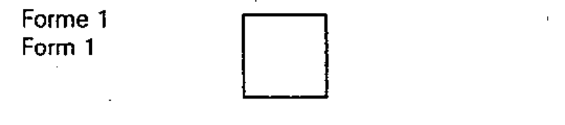
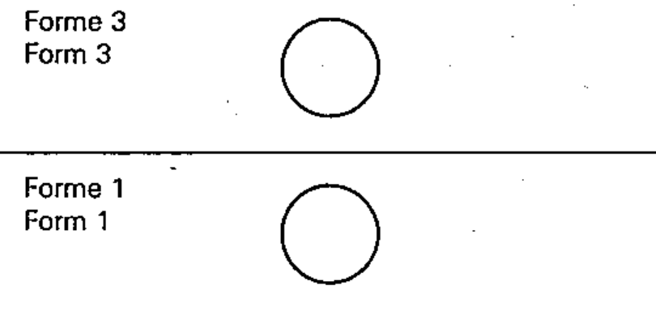
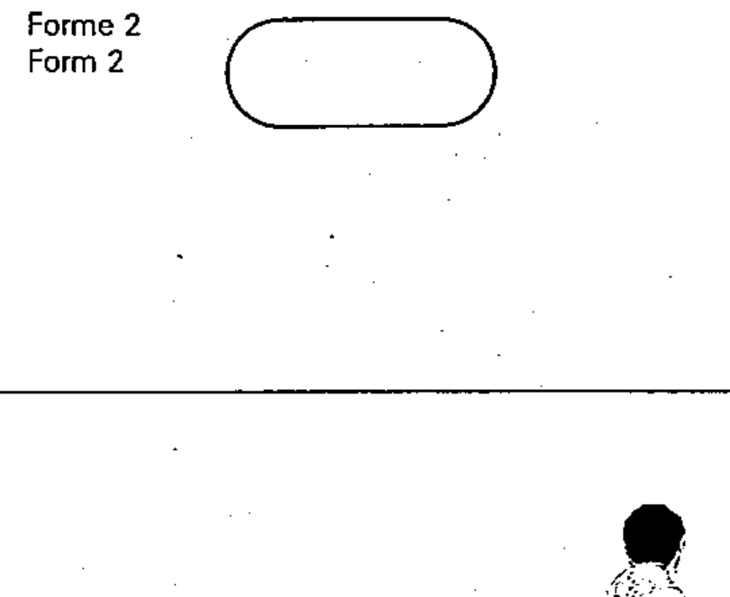
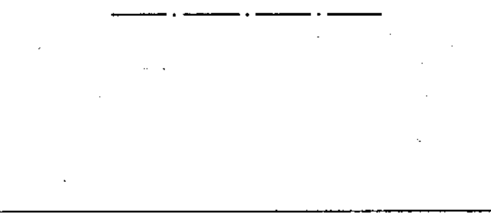
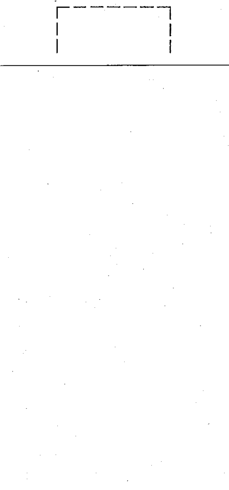

# 60617-2 Section 01 — Outlines and enclosures

*Cadres et enveloppes* · **Chapter I — Symbol elements** · **Part:** [[60617-2]] · 7 symbols

| No. | Symbol | Name (EN) | Notes |
|-----|--------|-----------|-------|
| [[02-01-01]] |  | Item / equipment / functional unit (Form 1) | Form 1 |
| [[02-01-02]] |  | Item / equipment / functional unit (Form 2) | Form 2 |
| [[02-01-03]] |  | Item / equipment / functional unit (Form 3) | Form 3 |
| [[02-01-04]] |  | Envelope (tank) / enclosure (Form 1) | Form 1 |
| [[02-01-05]] |  | Envelope (tank) / enclosure (Form 2) | Form 2 |
| [[02-01-06]] |  | Boundary line |  |
| [[02-01-07]] |  | Screen (shield) |  |
