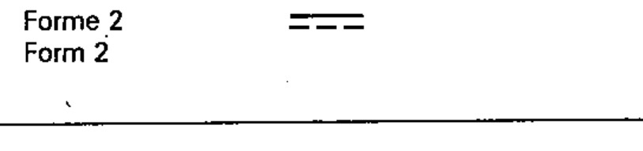
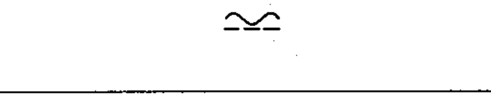
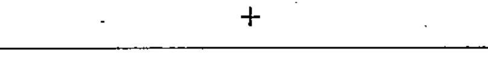
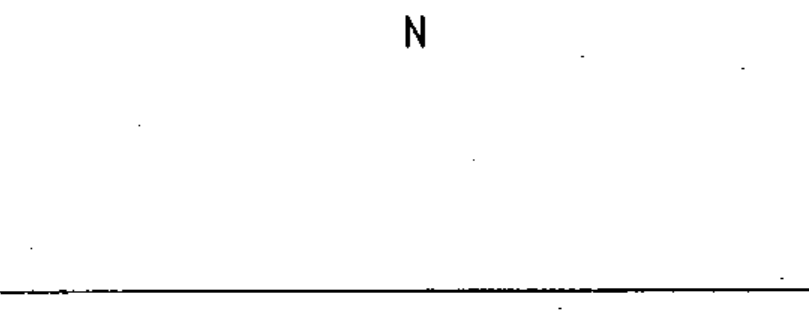
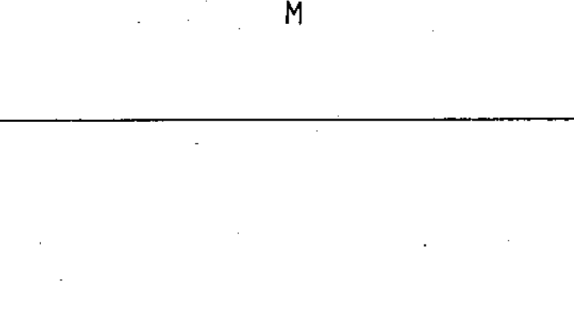

# 60617-2 Section 02 — Kind of current and voltage

*Nature du courant et de la tension* · **Chapter II — Qualifying symbols** · **Part:** [[60617-2]] · 16 symbols

| No. | Symbol | Name (EN) | Notes |
|-----|--------|-----------|-------|
| [[02-02-01]] |  | Direct current (Form 1) | Form 1 |
| [[02-02-02]] |  | Direct current, three conductors incl. mid-wire — example | example |
| [[02-02-03]] |  | Direct current (Form 2) | Form 2 |
| [[02-02-04]] |  | Alternating current |  |
| [[02-02-05]] |  | Alternating current, 50 Hz — example | example |
| [[02-02-06]] |  | Alternating current, frequency range 100–600 kHz — example | example |
| [[02-02-07]] |  | Three-phase with neutral, 50 Hz, 400/230 V — example | example |
| [[02-02-08]] |  | Three-phase AC, TN-S system — example | example |
| [[02-02-09]] |  | Relatively low frequencies |  |
| [[02-02-10]] |  | Medium frequencies |  |
| [[02-02-11]] |  | Relatively high frequencies |  |
| [[02-02-12]] |  | Rectified current with alternating component |  |
| [[02-02-13]] |  | Positive polarity |  |
| [[02-02-14]] |  | Negative polarity |  |
| [[02-02-15]] |  | Neutral |  |
| [[02-02-16]] |  | Mid-wire |  |
