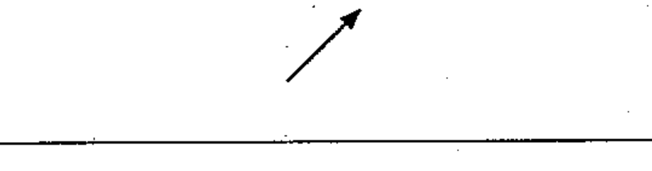
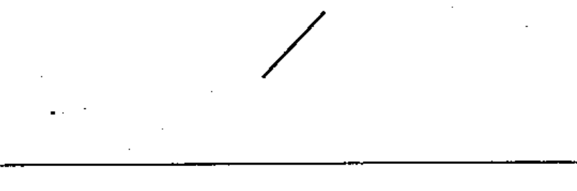
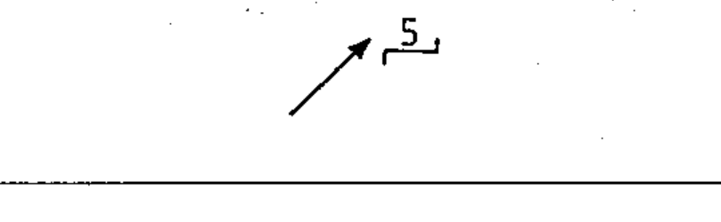

# 60617-2 Section 03 — Variability

*Variabilité* · **Chapter II — Qualifying symbols** · **Part:** [[60617-2]] · 12 symbols

| No. | Symbol | Name (EN) | Notes |
|-----|--------|-----------|-------|
| [[02-03-01]] |  | Variability, non-inherent |  |
| [[02-03-02]] |  | Variability, non-inherent, non-linear |  |
| [[02-03-03]] |  | Variability, inherent |  |
| [[02-03-04]] |  | Variability, inherent, non-linear |  |
| [[02-03-05]] |  | Pre-set adjustment |  |
| [[02-03-06]] |  | Pre-set adjustment at zero current only — example | example |
| [[02-03-07]] |  | Variability in steps / stepping action |  |
| [[02-03-08]] |  | Variability, non-inherent, in five steps — example | example |
| [[02-03-09]] |  | Continuous variability |  |
| [[02-03-10]] |  | Pre-set adjustment, continuously variable — example | example |
| [[02-03-11]] |  | Automatic (inherent) control |  |
| [[02-03-12]] |  | Amplifier with automatic gain control — example | example |
