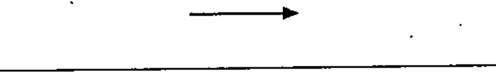
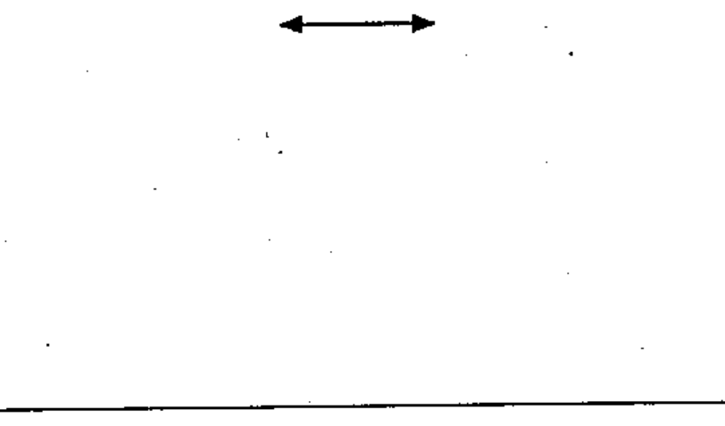
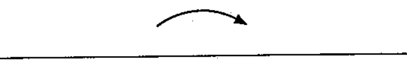
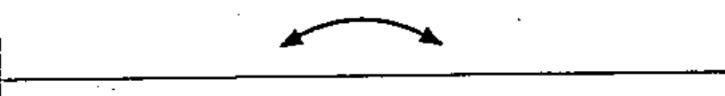
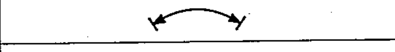
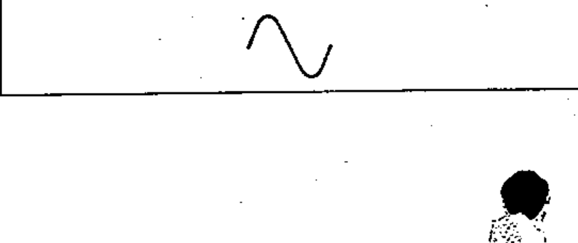

# 60617-2 Section 04 — Direction of force or motion

*Sens de l'effort ou du mouvement* · **Chapter II — Qualifying symbols** · **Part:** [[60617-2]] · 6 symbols

| No. | Symbol | Name (EN) | Notes |
|-----|--------|-----------|-------|
| [[02-04-01]] |  | Rectilinear force or motion in direction of arrow |  |
| [[02-04-02]] |  | Bidirectional rectilinear force or motion |  |
| [[02-04-03]] |  | Unidirectional rotation |  |
| [[02-04-04]] |  | Bidirectional rotation |  |
| [[02-04-05]] |  | Bidirectional rotation, limited |  |
| [[02-04-06]] |  | Reciprocating motion |  |
