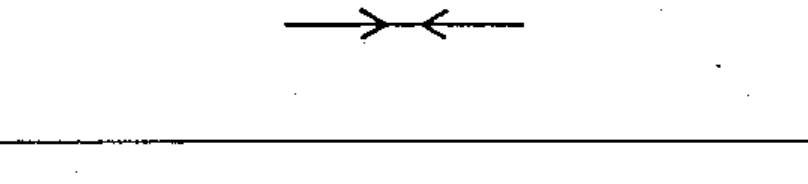
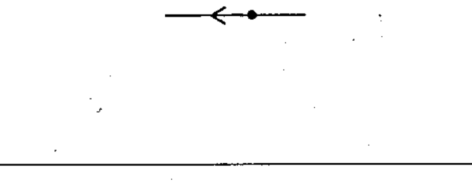
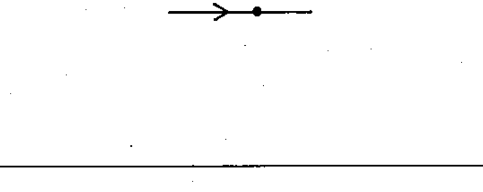
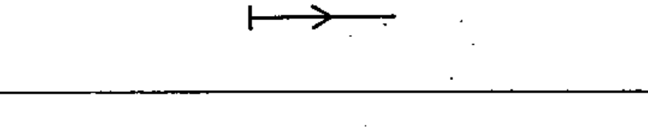
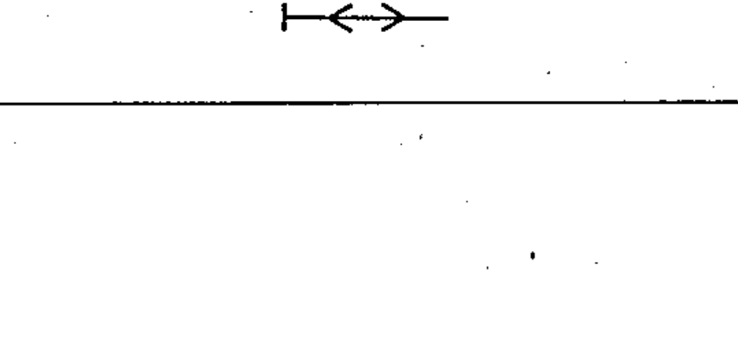

# 60617-2 Section 05 — Direction of flow

*Sens de propagation* · **Chapter II — Qualifying symbols** · **Part:** [[60617-2]] · 8 symbols

| No. | Symbol | Name (EN) | Notes |
|-----|--------|-----------|-------|
| [[02-05-01]] |  | Propagation / energy flow / signal flow, one way |  |
| [[02-05-02]] |  | Propagation both ways, simultaneously |  |
| [[02-05-03]] |  | Propagation both ways, not simultaneously |  |
| [[02-05-04]] |  | Transmission |  |
| [[02-05-05]] |  | Reception |  |
| [[02-05-06]] |  | Energy flow from the busbars |  |
| [[02-05-07]] |  | Energy flow towards the busbars |  |
| [[02-05-08]] |  | Bidirectional energy flow |  |
