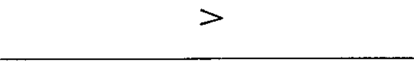
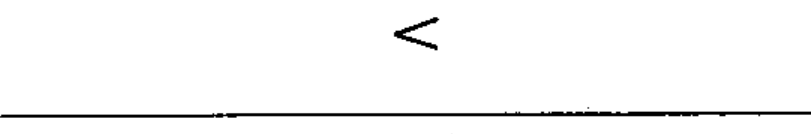
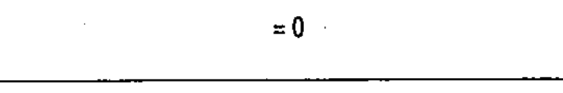

# 60617-2 Section 06 — Operational dependence on a characteristic quantity

*Fonctionnement dépendant d'une grandeur caractéristique* · **Chapter II — Qualifying symbols** · **Part:** [[60617-2]] · 5 symbols

| No. | Symbol | Name (EN) | Notes |
|-----|--------|-----------|-------|
| [[02-06-01]] |  | Operating above setting value (>) |  |
| [[02-06-02]] |  | Operating below setting value (<) |  |
| [[02-06-03]] |  | Operating outside a range (≷) |  |
| [[02-06-04]] |  | Operating at zero (=0) |  |
| [[02-06-05]] |  | Operating near zero (≈0) |  |
