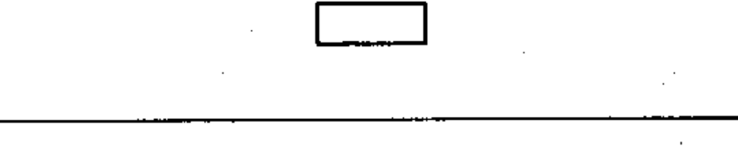
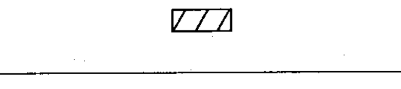
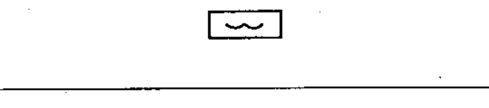
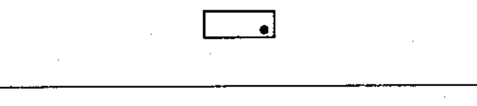
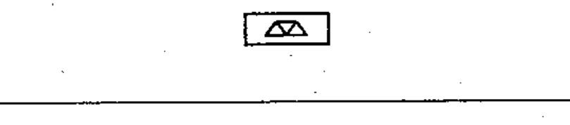
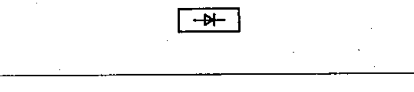
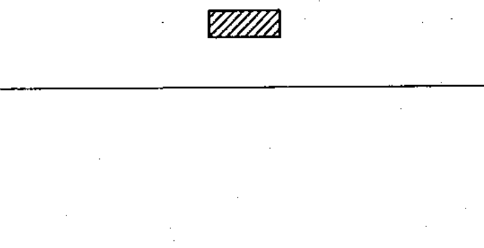

# 60617-2 Section 07 — Types of material

*Types de matière* · **Chapter II — Qualifying symbols** · **Part:** [[60617-2]] · 7 symbols

| No. | Symbol | Name (EN) | Notes |
|-----|--------|-----------|-------|
| [[02-07-01]] |  | Material, unspecified |  |
| [[02-07-02]] |  | Material, solid |  |
| [[02-07-03]] |  | Material, liquid |  |
| [[02-07-04]] |  | Material, gas |  |
| [[02-07-05]] |  | Material, electret |  |
| [[02-07-06]] |  | Material, semiconducting |  |
| [[02-07-07]] |  | Material, insulating (dielectric) |  |
