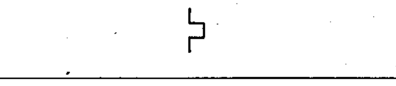
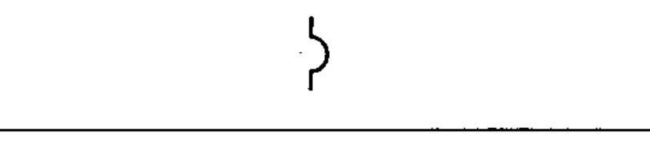
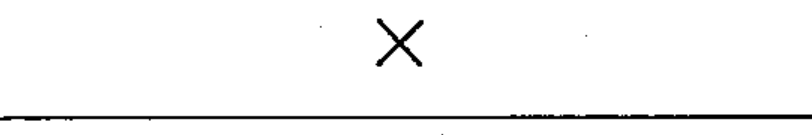

# 60617-2 Section 08 — Effect or dependence

*Effet ou dépendance* · **Chapter II — Qualifying symbols** · **Part:** [[60617-2]] · 5 symbols

| No. | Symbol | Name (EN) | Notes |
|-----|--------|-----------|-------|
| [[02-08-01]] |  | Thermal effect |  |
| [[02-08-02]] |  | Electromagnetic effect |  |
| [[02-08-03]] |  | Magnetostrictive effect |  |
| [[02-08-04]] |  | Magnetic field effect or dependence |  |
| [[02-08-05]] |  | Delay |  |
