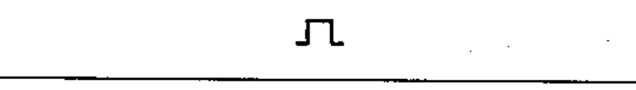
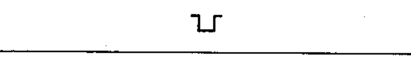
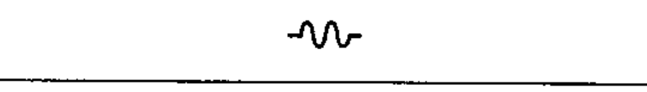
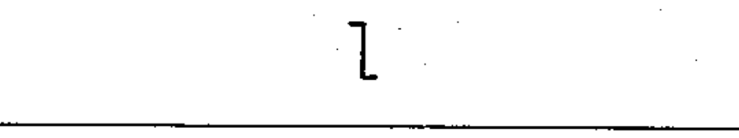
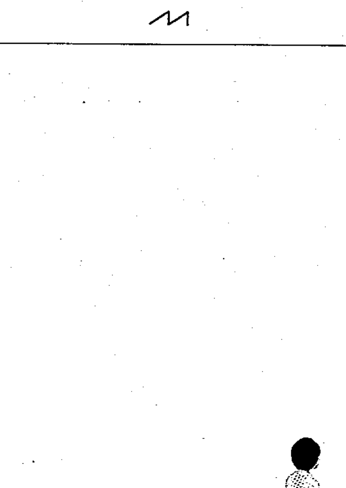

# 60617-2 Section 10 — Signal waveforms

*Forme des signaux* · **Chapter II — Qualifying symbols** · **Part:** [[60617-2]] · 6 symbols

| No. | Symbol | Name (EN) | Notes |
|-----|--------|-----------|-------|
| [[02-10-01]] |  | Positive-going pulse |  |
| [[02-10-02]] |  | Negative-going pulse |  |
| [[02-10-03]] |  | Pulse of alternating current |  |
| [[02-10-04]] |  | Positive-going step function |  |
| [[02-10-05]] |  | Negative-going step function |  |
| [[02-10-06]] |  | Saw-tooth |  |
