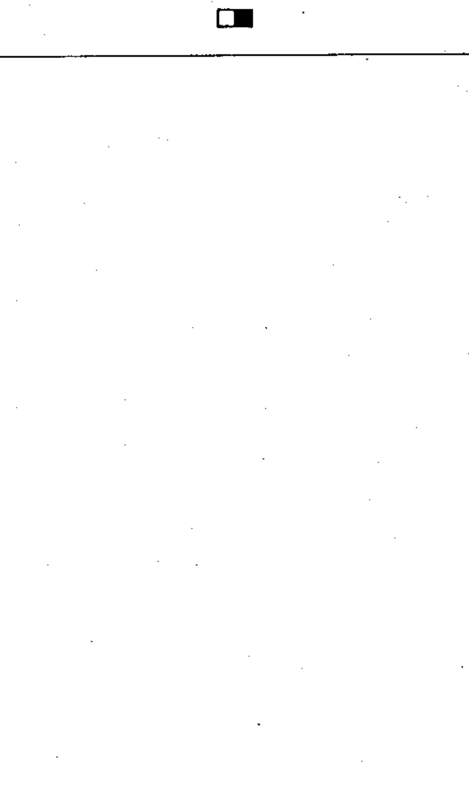

# 60617-2 Section 11 — Printing, perforating and facsimile

*Impression, perforation, télécopie* · **Chapter II — Qualifying symbols** · **Part:** [[60617-2]] · 6 symbols

| No. | Symbol | Name (EN) | Notes |
|-----|--------|-----------|-------|
| [[02-11-01]] |  | Tape printing |  |
| [[02-11-02]] |  | Tape perforating or using perforated tape |  |
| [[02-11-03]] |  | Simultaneous printing and perforating of one tape |  |
| [[02-11-04]] |  | Page printing |  |
| [[02-11-05]] |  | Keyboard |  |
| [[02-11-06]] |  | Facsimile |  |
