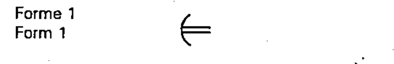
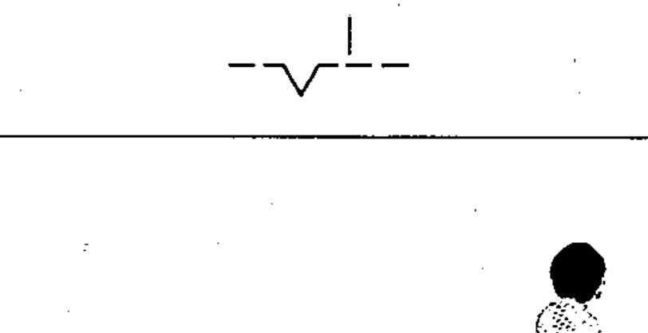
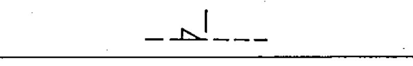
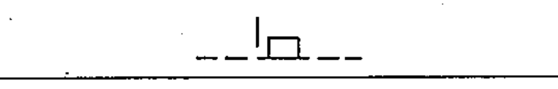
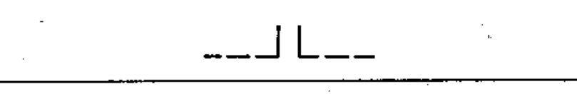
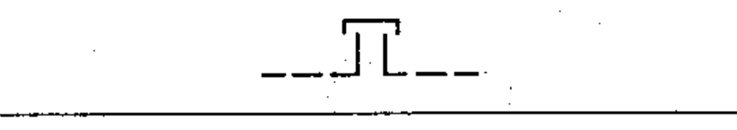
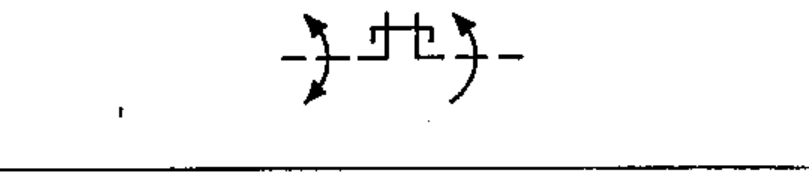
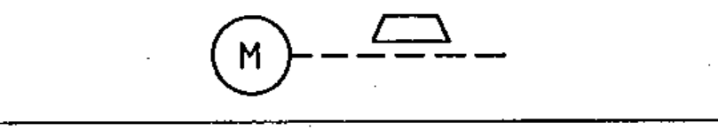
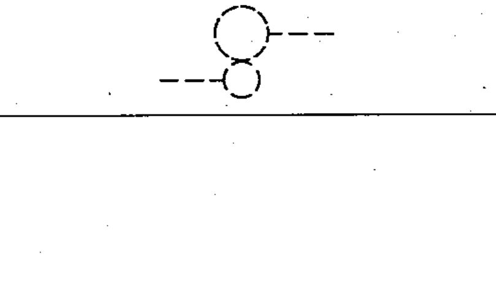

# 60617-2 Section 12 — Mechanical controls

*Commandes mécaniques* · **Chapter III — Other symbols having general application** · **Part:** [[60617-2]] · 23 symbols

| No. | Symbol | Name (EN) | Notes |
|-----|--------|-----------|-------|
| [[02-12-01]] |  | Mechanical / pneumatic / hydraulic connection (link) (Form 1) | Form 1 |
| [[02-12-02]] |  | Mechanical connection with direction of force/motion |  |
| [[02-12-03]] |  | Mechanical connection with direction of rotation |  |
| [[02-12-04]] |  | Mechanical connection (link) (Form 2) | Form 2 |
| [[02-12-05]] |  | Delayed action (Form 1) | Form 1 |
| [[02-12-06]] |  | Delayed action (Form 2) | Form 2 |
| [[02-12-07]] |  | Automatic return |  |
| [[02-12-08]] |  | Non-automatic return / device maintaining a position |  |
| [[02-12-09]] |  | Detent, disengaged |  |
| [[02-12-10]] |  | Detent, engaged |  |
| [[02-12-11]] |  | Mechanical interlock between two devices |  |
| [[02-12-12]] |  | Latching device, disengaged |  |
| [[02-12-13]] |  | Latching device, engaged |  |
| [[02-12-14]] |  | Blocking device |  |
| [[02-12-15]] |  | Blocking device engaged (movement to left blocked) |  |
| [[02-12-16]] |  | Clutch / mechanical coupling |  |
| [[02-12-17]] |  | Mechanical coupling, disengaged |  |
| [[02-12-18]] |  | Mechanical coupling, engaged |  |
| [[02-12-19]] |  | Unidirectional coupling (free wheel) — example | example |
| [[02-12-20]] |  | Brake |  |
| [[02-12-21]] |  | Electric motor with brake applied — example | example |
| [[02-12-22]] |  | Electric motor with brake released — example | example |
| [[02-12-23]] |  | Gearing |  |
