# 60617-2 Section 13 — Operating devices and methods

*Dispositifs et méthodes de commande* · **Chapter III — Other symbols having general application** · **Part:** [[60617-2]] · 27 symbols

| No. | Symbol | Name (EN) | Notes |
|-----|--------|-----------|-------|
| [[02-13-01]] | 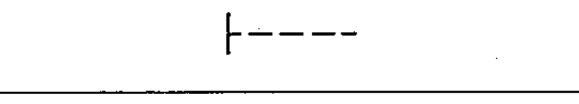 | Manually operated control, general case |  |
| [[02-13-02]] |  | Manually operated control with restricted access |  |
| [[02-13-03]] | 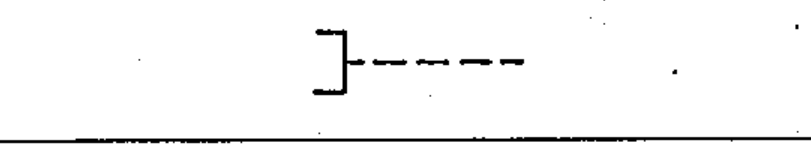 | Operated by pulling |  |
| [[02-13-04]] | 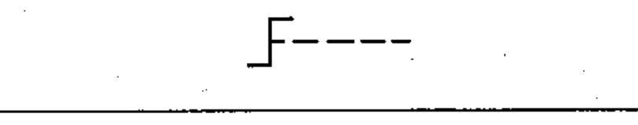 | Operated by turning |  |
| [[02-13-05]] | 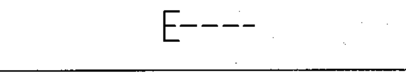 | Operated by pushing |  |
| [[02-13-06]] | 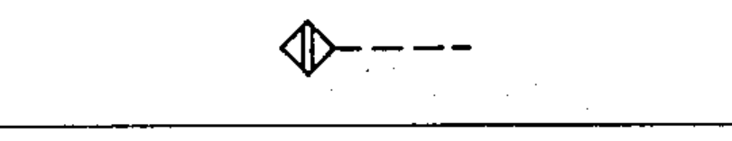 | Operated by proximity effect |  |
| [[02-13-07]] | 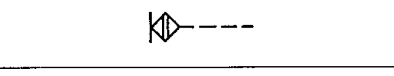 | Operated by touching |  |
| [[02-13-08]] | 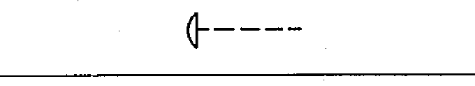 | Emergency switch (mushroom-head safety feature) |  |
| [[02-13-09]] | 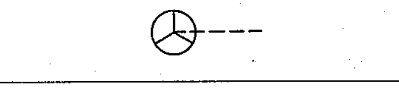 | Operated by handwheel |  |
| [[02-13-10]] | 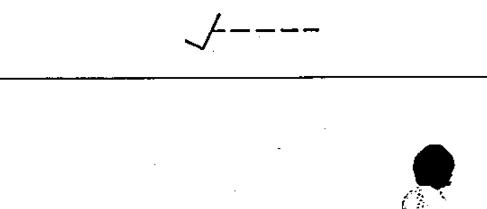 | Operated by pedal |  |
| [[02-13-11]] | 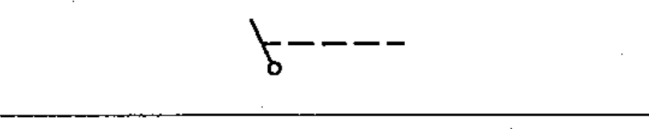 | Operated by lever |  |
| [[02-13-12]] | 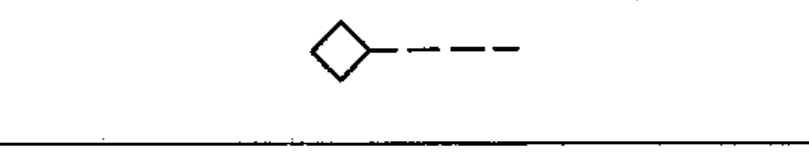 | Operated by removable handle |  |
| [[02-13-13]] | 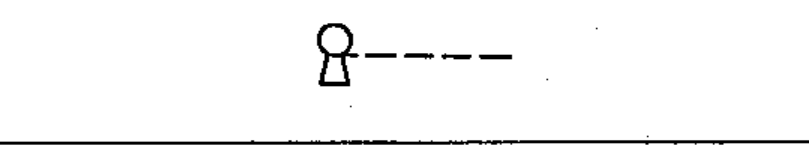 | Operated by key |  |
| [[02-13-14]] | 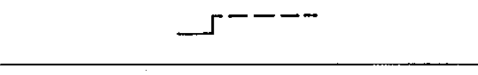 | Operated by crank |  |
| [[02-13-15]] | 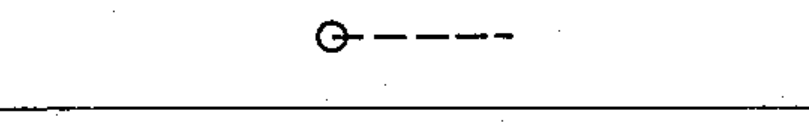 | Operated by roller |  |
| [[02-13-16]] |  | Operated by cam |  |
| [[02-13-17]] | 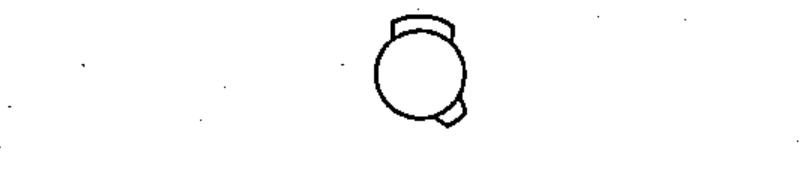 | Cam profile — example | example |
| [[02-13-18]] |  | Profile plate / cam profile (stepped) |  |
| [[02-13-19]] | 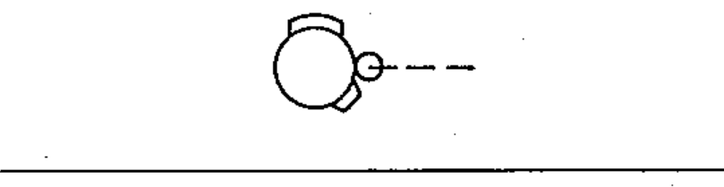 | Operated by cam and roller |  |
| [[02-13-20]] | 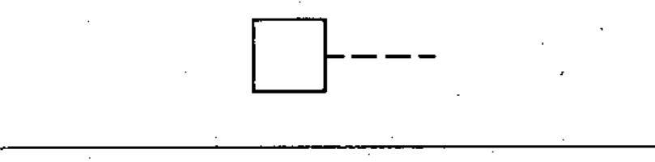 | Operated by stored mechanical energy |  |
| [[02-13-21]] | 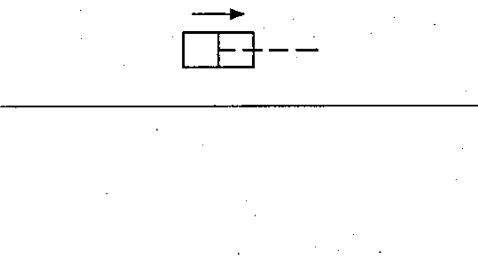 | Operated by pneumatic/hydraulic control, single acting |  |
| [[02-13-22]] | 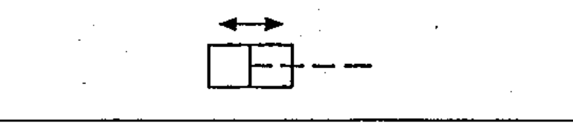 | Operated by pneumatic/hydraulic control, double acting |  |
| [[02-13-23]] | 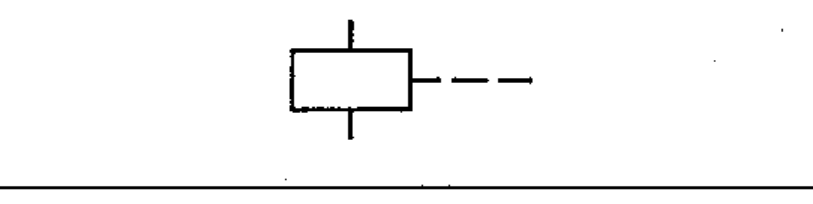 | Operated by electromagnetic actuator |  |
| [[02-13-24]] | 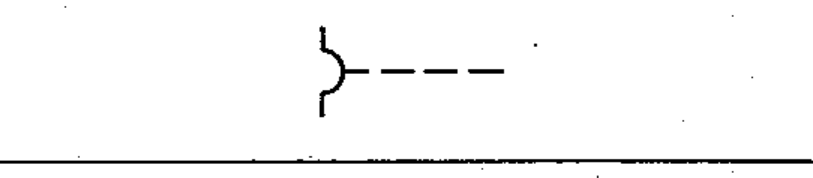 | Operated by electromagnetic overcurrent protection |  |
| [[02-13-25]] | 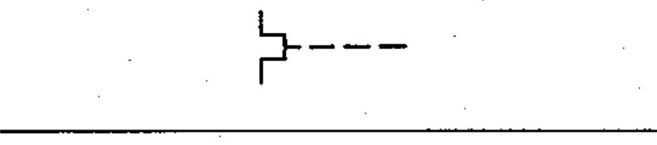 | Operated by thermal actuator |  |
| [[02-13-26]] | 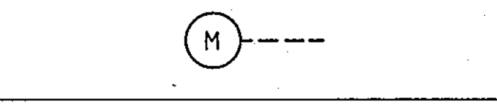 | Operated by electric motor |  |
| [[02-13-27]] | 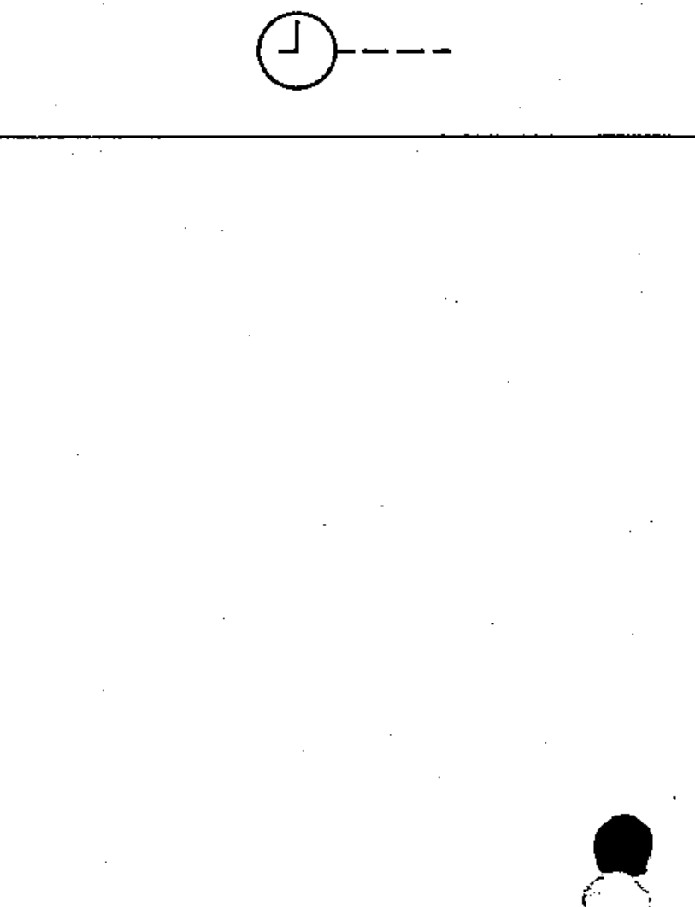 | Operated by electric clock |  |
