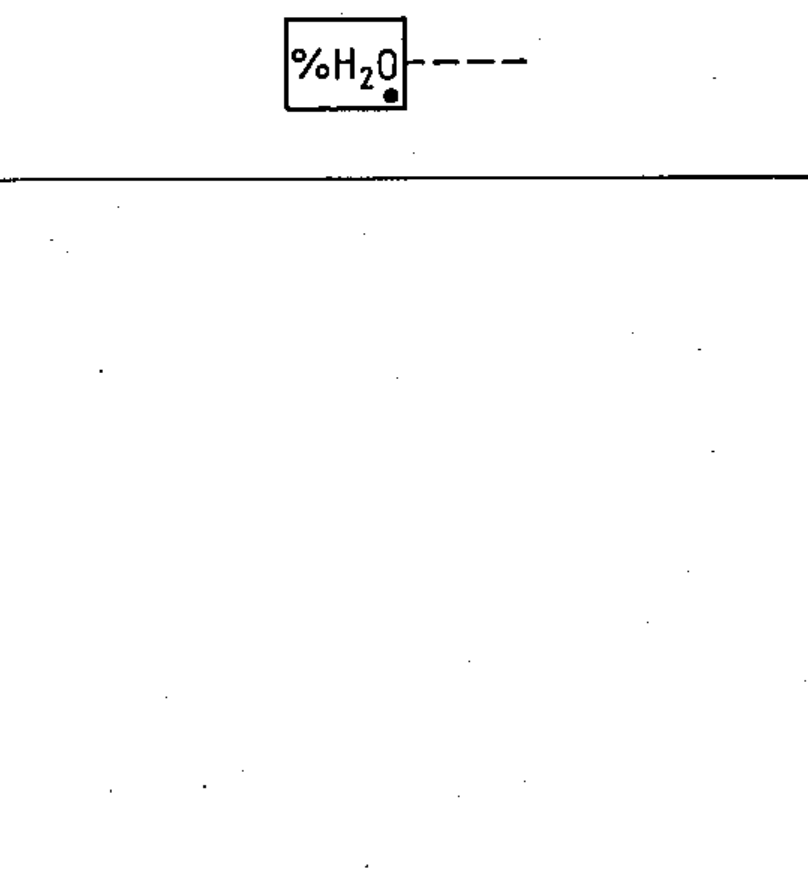

# 60617-2 Section 14 — Control by non-electrical quantities

*Commande par grandeurs non électriques* · **Chapter III — Other symbols having general application** · **Part:** [[60617-2]] · 5 symbols

| No. | Symbol | Name (EN) | Notes |
|-----|--------|-----------|-------|
| [[02-14-01]] |  | Control by fluid level |  |
| [[02-14-02]] |  | Control by number of events / by a counter |  |
| [[02-14-03]] |  | Control by flow |  |
| [[02-14-04]] |  | Control by gas flow — example | example |
| [[02-14-05]] |  | Control by relative humidity |  |
