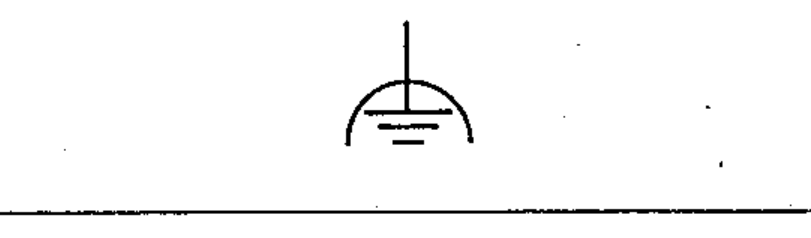
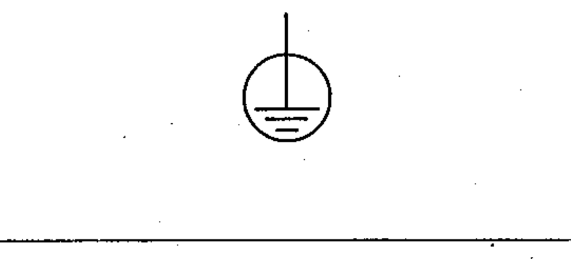
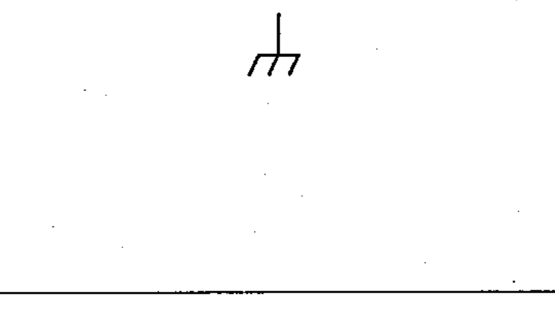
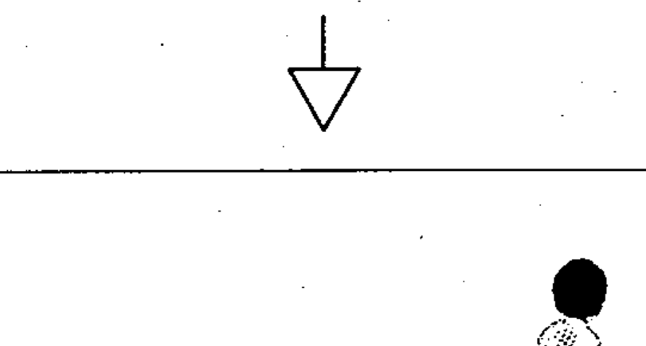

# 60617-2 Section 15 — Earth and frame connections, equipotentiality

*Mise à la terre et à la masse, équipotentialité* · **Chapter III — Other symbols having general application** · **Part:** [[60617-2]] · 5 symbols

| No. | Symbol | Name (EN) | Notes |
|-----|--------|-----------|-------|
| [[02-15-01]] |  | Earth (ground), general symbol |  |
| [[02-15-02]] |  | Noiseless earth (ground) |  |
| [[02-15-03]] |  | Protective earth (ground) |  |
| [[02-15-04]] |  | Frame / chassis |  |
| [[02-15-05]] |  | Equipotentiality |  |
