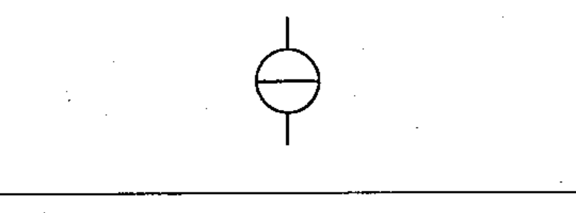
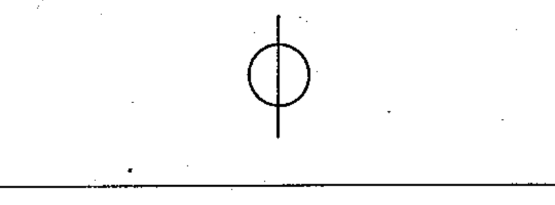
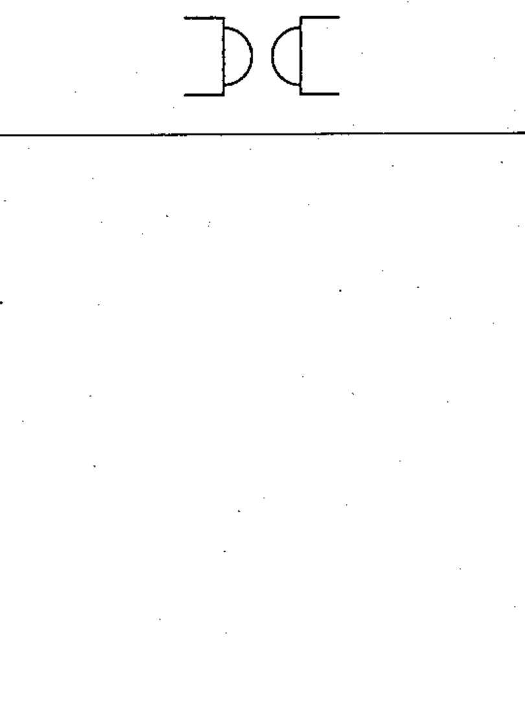

# 60617-2 Section 16 — Ideal circuit elements

*Éléments idéaux de circuit* · **Chapter III — Other symbols having general application** · **Part:** [[60617-2]] · 3 symbols

| No. | Symbol | Name (EN) | Notes |
|-----|--------|-----------|-------|
| [[02-16-01]] |  | Ideal current source |  |
| [[02-16-02]] |  | Ideal voltage source |  |
| [[02-16-03]] |  | Ideal gyrator |  |
