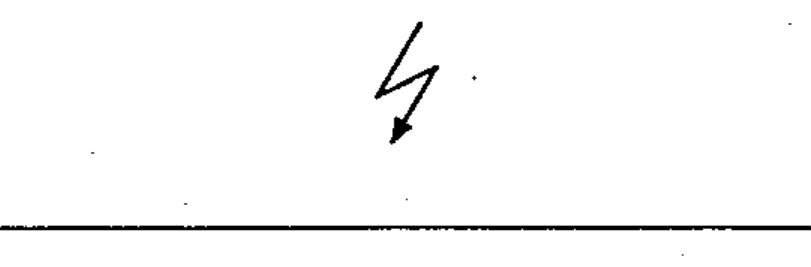
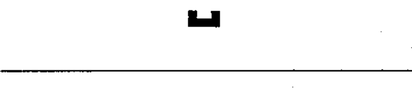
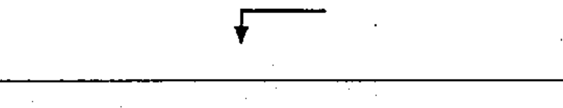

# 60617-2 Section 17 — Miscellaneous

*Divers* · **Chapter III — Other symbols having general application** · **Part:** [[60617-2]] · 9 symbols

| No. | Symbol | Name (EN) | Notes |
|-----|--------|-----------|-------|
| [[02-17-01]] |  | Fault (assumed location) |  |
| [[02-17-02]] |  | Flashover / break-through |  |
| [[02-17-03]] |  | Permanent magnet |  |
| [[02-17-04]] |  | Moving (e.g. sliding) contact |  |
| [[02-17-05]] |  | Test point indicator |  |
| [[02-17-06]] |  | Changer / converter, general symbol |  |
| [[02-17-07]] |  | Galvanic separator |  |
| [[02-17-08]] |  | Identifier of analogue signals |  |
| [[02-17-09]] |  | Identifier of digital signals |  |
