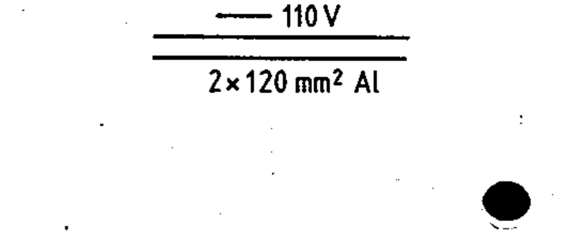
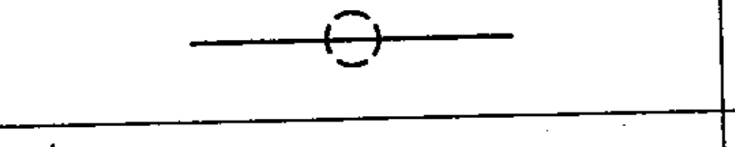
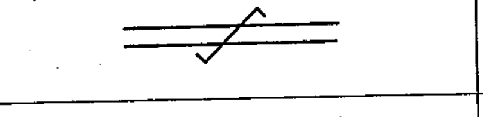
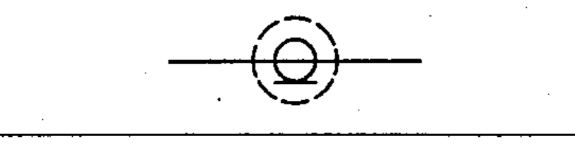
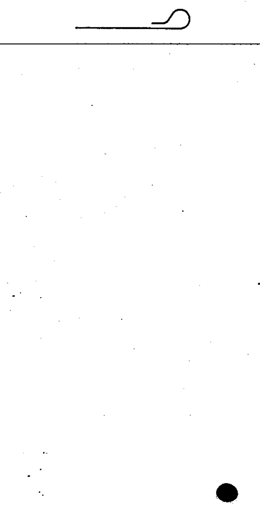

# 60617-3 Section 1 — Conductors

*Conducteurs* · **Part:** [[60617-3]] · 15 symbols (03-01-xx)

| No. | Symbol | Name (EN) | Notes |
|-----|--------|-----------|-------|
| [[03-01-01]] |  | Conductor |  |
| [[03-01-02]] |  | Three conductors (Form 1) | Form 1 |
| [[03-01-03]] |  | Three conductors (Form 2) | Form 2 |
| [[03-01-04]] |  | Direct-current circuit — annotation example ⓔ | example |
| [[03-01-05]] |  | Three-phase circuit — annotation example ⓔ | example |
| [[03-01-06]] |  | Flexible conductor |  |
| [[03-01-07]] |  | Screened conductor |  |
| [[03-01-08]] |  | Twisted conductors |  |
| [[03-01-09]] |  | Conductors in a cable |  |
| [[03-01-10]] |  | Conductors in a cable, non-adjacent — example ⓔ | example |
| [[03-01-11]] |  | Coaxial pair |  |
| [[03-01-12]] |  | Coaxial pair connected to terminals — example ⓔ | example |
| [[03-01-13]] |  | Coaxial pair with screen |  |
| [[03-01-14]] |  | Conductor or cable not connected |  |
| [[03-01-15]] |  | Conductor or cable not connected and specially insulated |  |

ⓔ = worked example.
