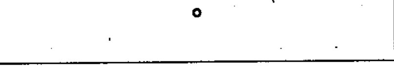
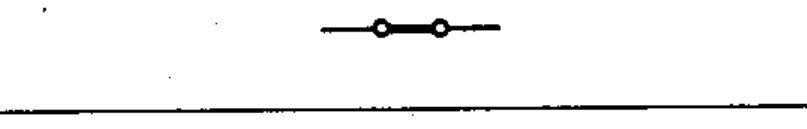
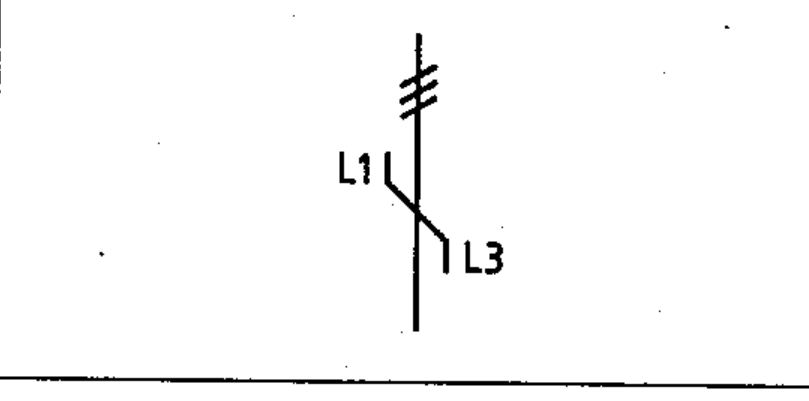

# 60617-3 Section 2 — Terminals and connections of conductors

*Bornes et connexions de conducteurs* · **Part:** [[60617-3]] · 14 symbols (03-02-xx)

| No. | Symbol | Name (EN) | Notes |
|-----|--------|-----------|-------|
| [[03-02-01]] |  | Connection of conductors |  |
| [[03-02-02]] |  | Terminal |  |
| [[03-02-03]] |  | Terminal strip |  |
| [[03-02-04]] |  | Junction of conductors (Form 1) | Form 1 |
| [[03-02-05]] |  | Junction of conductors (Form 2) | Form 2 |
| [[03-02-06]] |  | Double junction of conductors (Form 1) | Form 1 |
| [[03-02-07]] |  | Double junction of conductors (Form 2) | Form 2 |
| [[03-02-08]] |  | Conductor joint / in-line splice |  |
| [[03-02-09]] |  | Connection common to a group of similar items |  |
| [[03-02-10]] |  | Multipled uniselector hooks — example ⓔ | example |
| [[03-02-11]] |  | Interchange of conductors / change of phase sequence / inversion of polarity |  |
| [[03-02-12]] |  | Change of phase sequence — example ⓔ | example |
| [[03-02-13]] |  | Neutral point in a multi-phase system |  |
| [[03-02-14]] |  | Synchronous generator with external neutral point — example ⓔ | example |

ⓔ = worked example.
