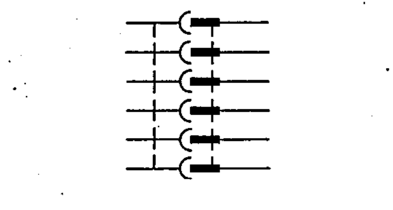
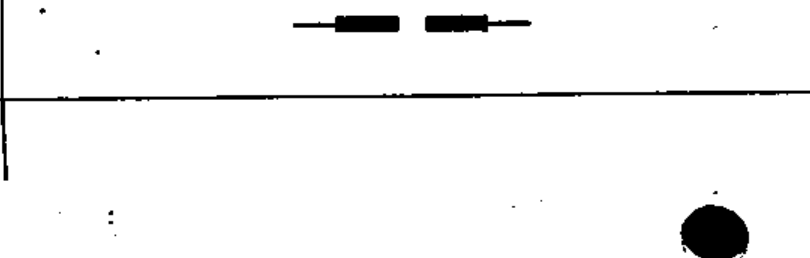
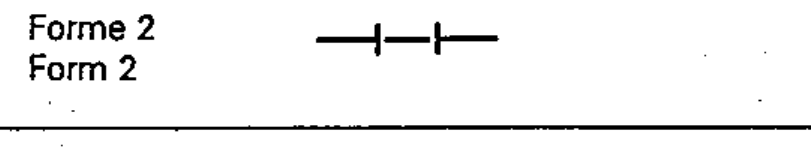

# 60617-3 Section 3 — Connecting devices

*Dispositifs de connexion* · **Part:** [[60617-3]] · 22 symbols (03-03-xx)

| No. | Symbol | Name (EN) | Notes |
|-----|--------|-----------|-------|
| [[03-03-01]] |  | Socket (female) |  |
| [[03-03-02]] |  | Pole of a socket |  |
| [[03-03-03]] |  | Plug (male) |  |
| [[03-03-04]] |  | Pole of a plug |  |
| [[03-03-05]] |  | Plug and socket (male and female) |  |
| [[03-03-06]] |  | Plug and socket (other form) |  |
| [[03-03-07]] |  | Multipole plug and socket — multi-line |  |
| [[03-03-08]] |  | Multipole plug and socket — single-line |  |
| [[03-03-09]] |  | Connector assembly, fixed portion |  |
| [[03-03-10]] |  | Connector assembly, movable portion |  |
| [[03-03-11]] |  | Mixed connector assembly |  |
| [[03-03-12]] |  | Plug and jack, telephone type, two-pole |  |
| [[03-03-13]] |  | Plug and jack, telephone type, three-pole |  |
| [[03-03-14]] |  | Break or isolating jack, telephone type |  |
| [[03-03-15]] |  | Coaxial plug and socket |  |
| [[03-03-16]] |  | Butt-connector |  |
| [[03-03-17]] |  | Connecting link, closed (Form 1) | Form 1 |
| [[03-03-18]] |  | Connecting link, closed (Form 2) | Form 2 |
| [[03-03-19]] |  | Connecting link, open |  |
| [[03-03-20]] |  | Plug-and-socket connector (U-link): male-male |  |
| [[03-03-21]] |  | Plug-and-socket connector: male-female |  |
| [[03-03-22]] |  | Plug-and-socket connector: male-male with socket access |  |

ⓔ = worked example.
