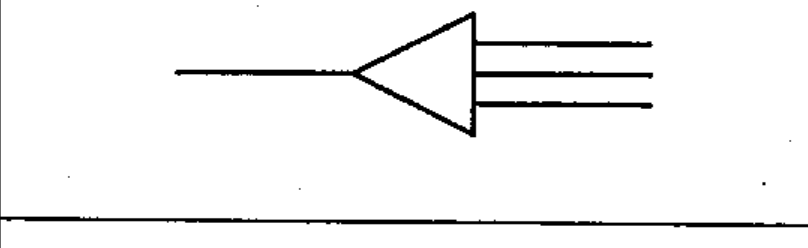
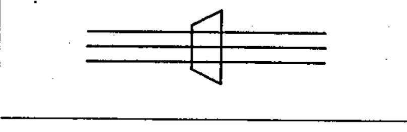
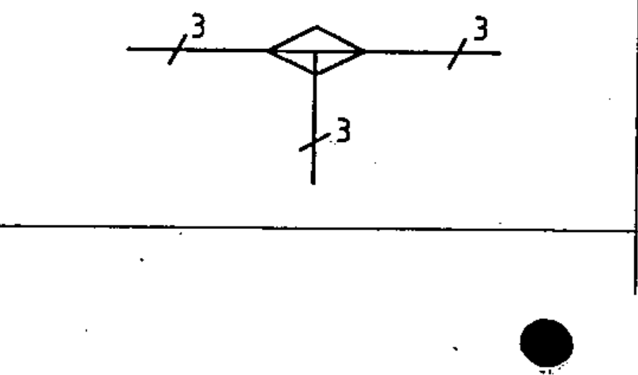

# 60617-3 Section 4 — Cable fittings

*Accessoires pour câbles* · **Part:** [[60617-3]] · 7 symbols (03-04-xx)

| No. | Symbol | Name (EN) | Notes |
|-----|--------|-----------|-------|
| [[03-04-01]] |  | Cable sealing end, with a three-core cable |  |
| [[03-04-02]] |  | Cable sealing end, with three single-core cables |  |
| [[03-04-03]] |  | Straight-through joint box — multi-line |  |
| [[03-04-04]] |  | Straight-through joint box — single-line |  |
| [[03-04-05]] |  | Junction box with T-connection — multi-line |  |
| [[03-04-06]] |  | Junction box with T-connection — single-line |  |
| [[03-04-07]] |  | Pressure-tight bulkhead cable gland |  |

ⓔ = worked example.
