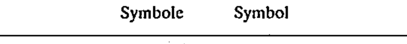

# 02-01-01 — Item / equipment / functional unit (Form 1)

Per-symbol crop from Publication No.617-2.pdf, printed p.8 ([full page](../assets/60617-2/p10.png)).

**Standard:** [[60617-2]] · **Chapter I — Symbol elements** · **Section:** [[60617-2-01-outlines-enclosures]] · **Form 1**

## Description
General outline for an item, equipment, unit or functional unit (square/rectangle). Form 1.

## Names
- **EN:** Item / equipment / functional unit (Form 1)
- **FR:** Dispositif / équipement / unité fonctionnelle (Forme 1)

## Notes
- Suitable symbols or legends shall be inserted in or added to the symbol outline to indicate the item, equipment or function.

## Related
- [[02-01-02]] — alternative form
- [[02-01-03]] — alternative form
