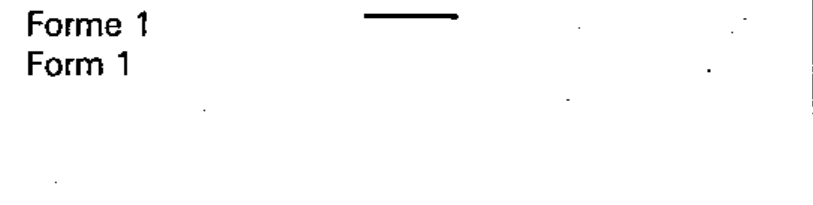

# 02-02-01 — Direct current (Form 1)

Per-symbol crop from Publication No.617-2.pdf, printed p.10 ([full page](../assets/60617-2/p12.png)).

**Standard:** [[60617-2]] · **Chapter II — Qualifying symbols** · **Section:** [[60617-2-02-current-voltage]] · **Form 1**

## Description
Direct current.

## Names
- **EN:** Direct current (Form 1)
- **FR:** Courant continu (Forme 1)

## Notes
- The voltage may be indicated at the right of the symbol and the type of system at the left.

## Related
- [[02-02-03]] — alternative form
