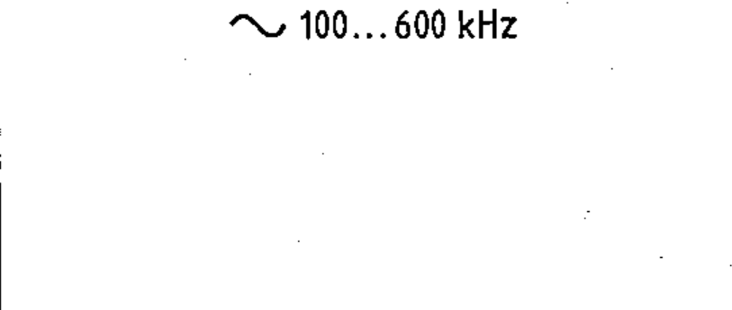

# 02-02-06 — Alternating current, frequency range 100–600 kHz — example

Per-symbol crop from Publication No.617-2.pdf, printed p.10 ([full page](../assets/60617-2/p12.png)).

**Standard:** [[60617-2]] · **Chapter II — Qualifying symbols** · **Section:** [[60617-2-02-current-voltage]]

## Description
Worked example: alternating current frequency range 100 kHz to 600 kHz. The voltage may also be indicated to the right of the symbol.

## Names
- **EN:** Alternating current, frequency range 100–600 kHz — example
- **FR:** Courant alternatif, gamme de fréquences 100–600 kHz — exemple

## Related
- [[02-02-04]]
