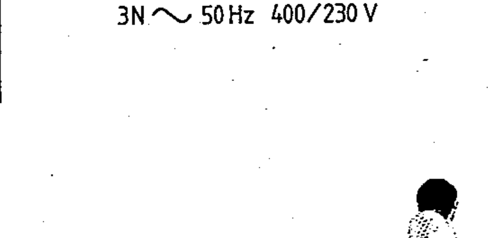

# 02-02-07 — Three-phase with neutral, 50 Hz, 400/230 V — example

Per-symbol crop from Publication No.617-2.pdf, printed p.10 ([full page](../assets/60617-2/p12.png)).

**Standard:** [[60617-2]] · **Chapter II — Qualifying symbols** · **Section:** [[60617-2-02-current-voltage]]

## Description
Worked example: alternating current, three-phase with neutral, 50 Hz, 400 V (230 V between phase and neutral), shown as “3N ∿ 50 Hz 400/230 V”. 3N may be replaced by 3+N.

## Names
- **EN:** Three-phase with neutral, 50 Hz, 400/230 V — example
- **FR:** Triphasé avec neutre, 50 Hz, 400/230 V — exemple

