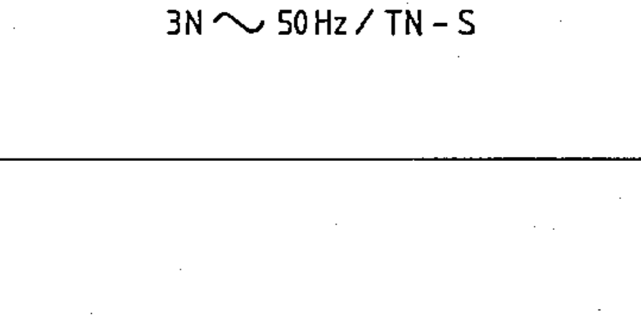

# 02-02-08 — Three-phase AC, TN-S system — example

Per-symbol crop from Publication No.617-2.pdf, printed p.11 ([full page](../assets/60617-2/p13.png)).

**Standard:** [[60617-2]] · **Chapter II — Qualifying symbols** · **Section:** [[60617-2-02-current-voltage]]

## Description
Worked example: alternating current, three-phase, 50 Hz, with neutral and protective conductor separate (TN-S).

## Names
- **EN:** Three-phase AC, TN-S system — example
- **FR:** Triphasé, système TN-S — exemple

## Notes
- If it is necessary to indicate a system in accordance with the designations established in IEC Publication 364-3 (Electrical installations of buildings, Part 3), the corresponding designation should be added to the right of the symbol.

## Related
- references **IEC 364-3**
