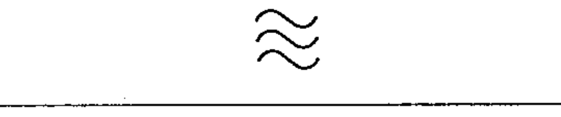

# 02-02-11 — Relatively high frequencies

Per-symbol crop from Publication No.617-2.pdf, printed p.11 ([full page](../assets/60617-2/p13.png)).

**Standard:** [[60617-2]] · **Chapter II — Qualifying symbols** · **Section:** [[60617-2-02-current-voltage]]

## Description
Relatively high frequencies (example: super-audio, carrier and radio frequencies).

## Names
- **EN:** Relatively high frequencies
- **FR:** Fréquences relativement hautes

## Related
- [[02-02-09]]
- [[02-02-10]]
