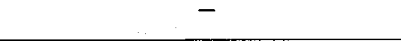

# 02-02-14 — Negative polarity

Per-symbol crop from Publication No.617-2.pdf, printed p.11 ([full page](../assets/60617-2/p13.png)).

**Standard:** [[60617-2]] · **Chapter II — Qualifying symbols** · **Section:** [[60617-2-02-current-voltage]]

## Description
Negative polarity (−).

## Names
- **EN:** Negative polarity
- **FR:** Polarité négative

## Related
- [[02-02-13]]
