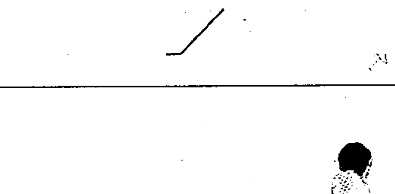

# 02-03-04 — Variability, inherent, non-linear

Per-symbol crop from Publication No.617-2.pdf, printed p.12 ([full page](../assets/60617-2/p14.png)).

**Standard:** [[60617-2]] · **Chapter II — Qualifying symbols** · **Section:** [[60617-2-03-variability]]

## Description
Inherent, non-linear variability.

## Names
- **EN:** Variability, inherent, non-linear
- **FR:** Variabilité intrinsèque non linéaire

## Notes
- The note with symbol 02-03-03 applies.

## Related
- [[02-03-03]]
