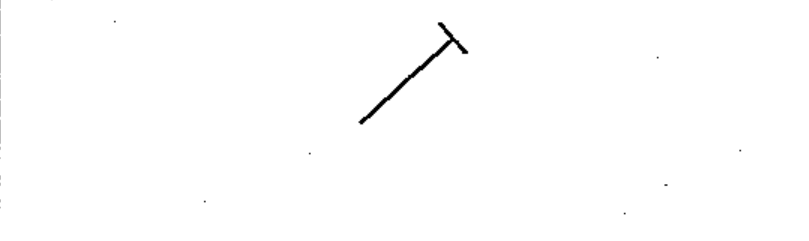

# 02-03-05 — Pre-set adjustment

Per-symbol crop from Publication No.617-2.pdf, printed p.13 ([full page](../assets/60617-2/p15.png)).

**Standard:** [[60617-2]] · **Chapter II — Qualifying symbols** · **Section:** [[60617-2-03-variability]]

## Description
Pre-set adjustment.

## Names
- **EN:** Pre-set adjustment
- **FR:** Ajustement prédéterminé

## Notes
- Information on the conditions under which adjustment is permitted may be shown near the symbol.

