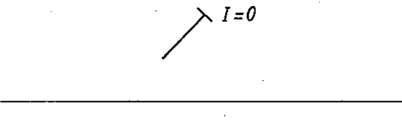

# 02-03-06 — Pre-set adjustment at zero current only — example

Per-symbol crop from Publication No.617-2.pdf, printed p.13 ([full page](../assets/60617-2/p15.png)).

**Standard:** [[60617-2]] · **Chapter II — Qualifying symbols** · **Section:** [[60617-2-03-variability]]

## Description
Worked example: pre-set adjustment permitted only at zero current (“I = 0”).

## Names
- **EN:** Pre-set adjustment at zero current only — example
- **FR:** Ajustement prédéterminé autorisé à courant nul — exemple

## Related
- [[02-03-05]]
