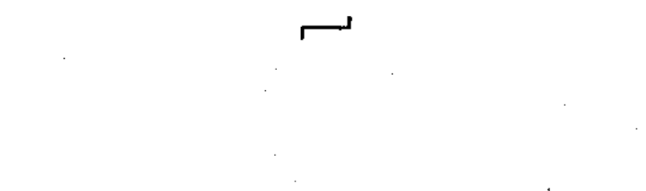

# 02-03-07 — Variability in steps / stepping action

Per-symbol crop from Publication No.617-2.pdf, printed p.13 ([full page](../assets/60617-2/p15.png)).

**Standard:** [[60617-2]] · **Chapter II — Qualifying symbols** · **Section:** [[60617-2-03-variability]]

## Description
Variability in steps; stepping action.

## Names
- **EN:** Variability in steps / stepping action
- **FR:** Variabilité par échelons / action pas à pas

## Notes
- A figure indicating the number of steps may be added.

