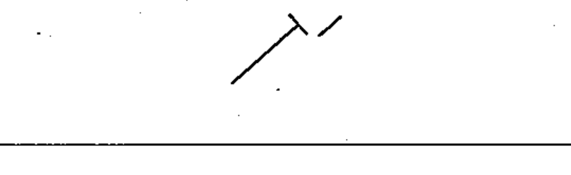

# 02-03-10 — Pre-set adjustment, continuously variable — example

Per-symbol crop from Publication No.617-2.pdf, printed p.13 ([full page](../assets/60617-2/p15.png)).

**Standard:** [[60617-2]] · **Chapter II — Qualifying symbols** · **Section:** [[60617-2-03-variability]]

## Description
Worked example: pre-set adjustment, continuously variable.

## Names
- **EN:** Pre-set adjustment, continuously variable — example
- **FR:** Ajustement prédéterminé à action continue — exemple

## Related
- [[02-03-05]]
- [[02-03-09]]
