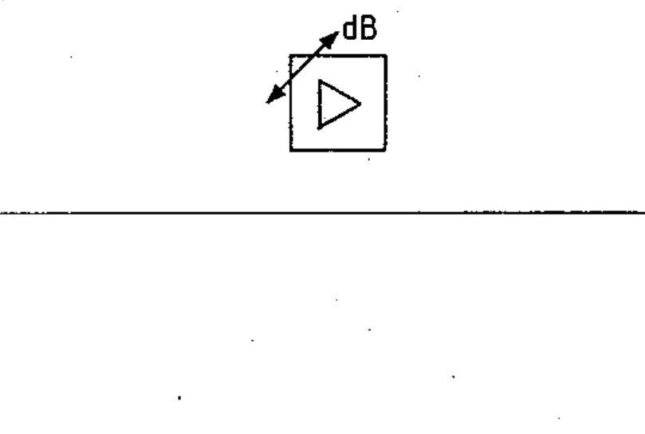

# 02-03-12 — Amplifier with automatic gain control — example

Per-symbol crop from Publication No.617-2.pdf, printed p.13 ([full page](../assets/60617-2/p15.png)).

**Standard:** [[60617-2]] · **Chapter II — Qualifying symbols** · **Section:** [[60617-2-03-variability]]

## Description
Worked example: amplifier with automatic gain control (AGC), shown “dB ▷”.

## Names
- **EN:** Amplifier with automatic gain control — example
- **FR:** Amplificateur avec contrôle automatique de gain — exemple

## Related
- [[02-03-11]]
