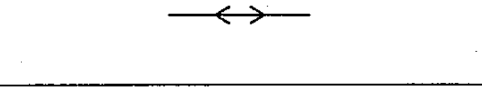

# 02-05-03 — Propagation both ways, not simultaneously

Per-symbol crop from Publication No.617-2.pdf, printed p.15 ([full page](../assets/60617-2/p17.png)).

**Standard:** [[60617-2]] · **Chapter II — Qualifying symbols** · **Section:** [[60617-2-05-flow]]

## Description
Propagation both ways, not simultaneously; alternate transmission and reception.

## Names
- **EN:** Propagation both ways, not simultaneously
- **FR:** Propagations non simultanées dans les deux sens

## Related
- [[02-05-02]]
