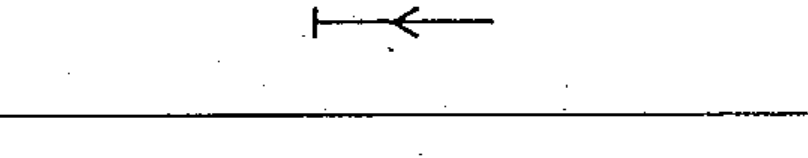

# 02-05-07 — Energy flow towards the busbars

Per-symbol crop from Publication No.617-2.pdf, printed p.15 ([full page](../assets/60617-2/p17.png)).

**Standard:** [[60617-2]] · **Chapter II — Qualifying symbols** · **Section:** [[60617-2-05-flow]]

## Description
Energy flow towards the busbars.

## Names
- **EN:** Energy flow towards the busbars
- **FR:** Transit de l'énergie vers les barres

## Related
- [[02-05-06]]
