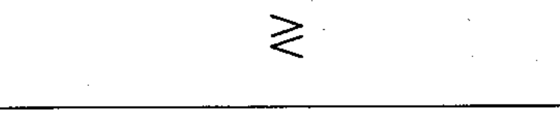

# 02-06-03 — Operating outside a range (≷)

Per-symbol crop from Publication No.617-2.pdf, printed p.16 ([full page](../assets/60617-2/p18.png)).

**Standard:** [[60617-2]] · **Chapter II — Qualifying symbols** · **Section:** [[60617-2-06-characteristic-quantity]]

## Description
Operating when the characteristic quantity is either higher than a given high setting or lower than a given low setting.

## Names
- **EN:** Operating outside a range (≷)
- **FR:** Fonctionnement hors d'une plage (≷)

