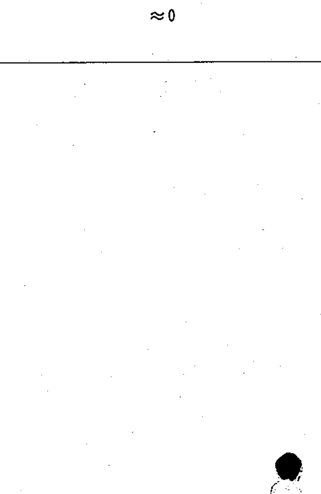

# 02-06-05 — Operating near zero (≈0)

Per-symbol crop from Publication No.617-2.pdf, printed p.16 ([full page](../assets/60617-2/p18.png)).

**Standard:** [[60617-2]] · **Chapter II — Qualifying symbols** · **Section:** [[60617-2-06-characteristic-quantity]]

## Description
Operating when the value of the characteristic quantity differs from zero by an amount which is very small compared with the normal value.

## Names
- **EN:** Operating near zero (≈0)
- **FR:** Fonctionnement proche de zéro (≈0)

