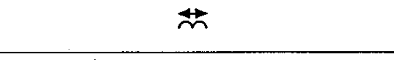

# 02-08-03 — Magnetostrictive effect

Per-symbol crop from Publication No.617-2.pdf, printed p.18 ([full page](../assets/60617-2/p20.png)).

**Standard:** [[60617-2]] · **Chapter II — Qualifying symbols** · **Section:** [[60617-2-08-effect-dependence]]

## Description
Magnetostrictive effect.

## Names
- **EN:** Magnetostrictive effect
- **FR:** Effet par magnétostriction

