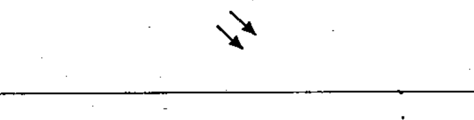

# 02-09-01 — Radiation, non-ionizing, electromagnetic

Per-symbol crop from Publication No.617-2.pdf, printed p.19 ([full page](../assets/60617-2/p21.png)).

**Standard:** [[60617-2]] · **Chapter II — Qualifying symbols** · **Section:** [[60617-2-09-radiation]]

## Description
Radiation, non-ionizing, electromagnetic (for example radio waves or visible light). Arrows pointing away from a symbol denote emission by the device.

## Names
- **EN:** Radiation, non-ionizing, electromagnetic
- **FR:** Rayonnement électromagnétique non ionisant

