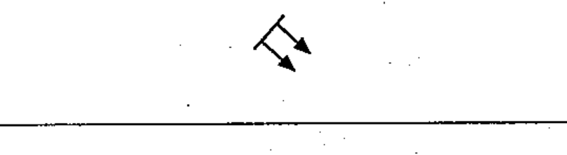

# 02-09-02 — Coherent radiation, non-ionizing

Per-symbol crop from Publication No.617-2.pdf, printed p.19 ([full page](../assets/60617-2/p21.png)).

**Standard:** [[60617-2]] · **Chapter II — Qualifying symbols** · **Section:** [[60617-2-09-radiation]]

## Description
Coherent radiation, non-ionizing (for example coherent light).

## Names
- **EN:** Coherent radiation, non-ionizing
- **FR:** Rayonnement cohérent, non ionisant

