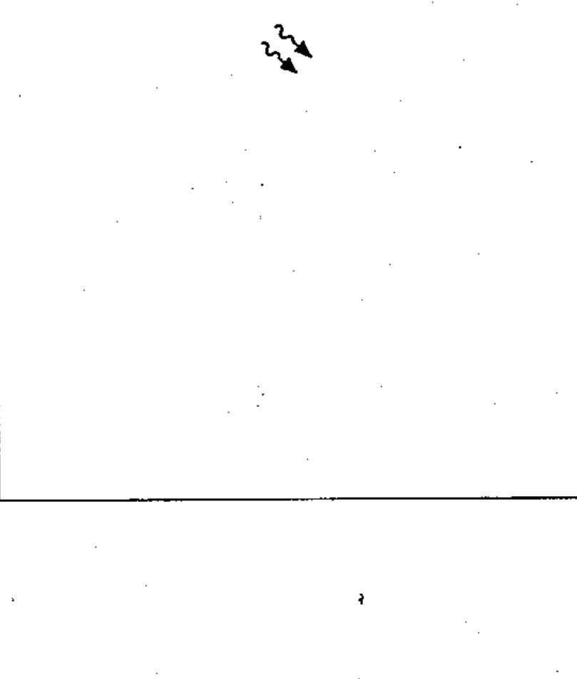

# 02-09-03 — Radiation, ionizing

Per-symbol crop from Publication No.617-2.pdf, printed p.19 ([full page](../assets/60617-2/p21.png)).

**Standard:** [[60617-2]] · **Chapter II — Qualifying symbols** · **Section:** [[60617-2-09-radiation]]

## Description
Radiation, ionizing.

## Names
- **EN:** Radiation, ionizing
- **FR:** Rayonnement ionisant

## Notes
- If it is necessary to show the specific type of ionizing radiation, the symbol may be supplemented by letters: α alpha particle, β beta particle, γ gamma rays, D deuteron, p proton, η neutron, π pion, κ K meson, μ muon, X X-ray.

