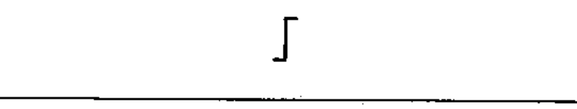

# 02-10-04 — Positive-going step function

Per-symbol crop from Publication No.617-2.pdf, printed p.20 ([full page](../assets/60617-2/p22.png)).

**Standard:** [[60617-2]] · **Chapter II — Qualifying symbols** · **Section:** [[60617-2-10-waveforms]]

## Description
Positive-going step function.

## Names
- **EN:** Positive-going step function
- **FR:** Fonction échelon positive

## Related
- [[02-10-05]]
