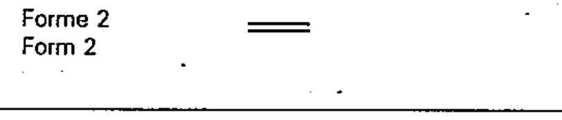

# 02-12-04 — Mechanical connection (link) (Form 2)

Per-symbol crop from Publication No.617-2.pdf, printed p.22 ([full page](../assets/60617-2/p24.png)).

**Standard:** [[60617-2]] · **Chapter III — Other symbols having general application** · **Section:** [[60617-2-12-mechanical-controls]] · **Form 2**

## Description
Mechanical connection (link). Form 2.

## Names
- **EN:** Mechanical connection (link) (Form 2)
- **FR:** Liaison mécanique (Forme 2)

## Notes
- To be used if the space is too restricted to permit the use of symbol 02-12-01.

## Related
- [[02-12-01]] — alternative form
