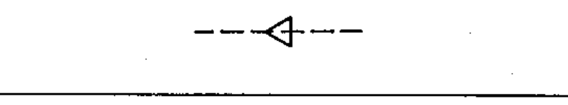

# 02-12-07 — Automatic return

Per-symbol crop from Publication No.617-2.pdf, printed p.22 ([full page](../assets/60617-2/p24.png)).

**Standard:** [[60617-2]] · **Chapter III — Other symbols having general application** · **Section:** [[60617-2-12-mechanical-controls]]

## Description
Automatic return.

## Names
- **EN:** Automatic return
- **FR:** Retour automatique

## Notes
- The triangle is pointed in the return direction.

