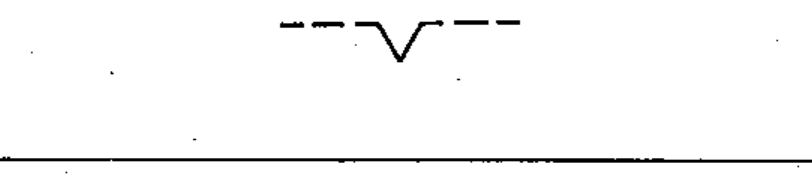

# 02-12-08 — Non-automatic return / device maintaining a position

Per-symbol crop from Publication No.617-2.pdf, printed p.22 ([full page](../assets/60617-2/p24.png)).

**Standard:** [[60617-2]] · **Chapter III — Other symbols having general application** · **Section:** [[60617-2-12-mechanical-controls]]

## Description
Non-automatic return; device for maintaining a given position.

## Names
- **EN:** Non-automatic return / device maintaining a position
- **FR:** Retour non automatique / dispositif de maintien dans une position

