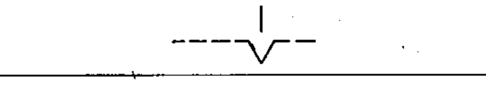

# 02-12-10 — Detent, engaged

Per-symbol crop from Publication No.617-2.pdf, printed p.23 ([full page](../assets/60617-2/p25.png)).

**Standard:** [[60617-2]] · **Chapter III — Other symbols having general application** · **Section:** [[60617-2-12-mechanical-controls]]

## Description
Detent, engaged.

## Names
- **EN:** Detent, engaged
- **FR:** Crantage, en prise

## Related
- [[02-12-09]]
