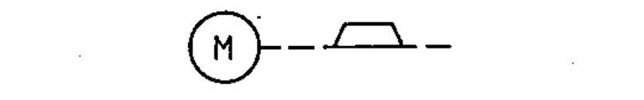

# 02-12-21 — Electric motor with brake applied — example

Per-symbol crop from Publication No.617-2.pdf, printed p.23 ([full page](../assets/60617-2/p25.png)).

**Standard:** [[60617-2]] · **Chapter III — Other symbols having general application** · **Section:** [[60617-2-12-mechanical-controls]]

## Description
Worked example: electric motor with brake applied.

## Names
- **EN:** Electric motor with brake applied — example
- **FR:** Moteur électrique avec frein serré — exemple

## Related
- [[02-12-20]]
