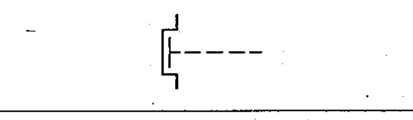

# 02-13-02 — Manually operated control with restricted access

Per-symbol crop from Publication No.617-2.pdf, printed p.24 ([full page](../assets/60617-2/p26.png)).

**Standard:** [[60617-2]] · **Chapter III — Other symbols having general application** · **Section:** [[60617-2-13-operating-devices]]

## Description
Manually operated control with restricted access.

## Names
- **EN:** Manually operated control with restricted access
- **FR:** Commande manuelle à accès restreint

## Related
- [[02-13-01]]
