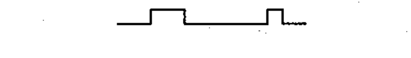

# 02-13-18 — Profile plate / cam profile (stepped)

Per-symbol crop from Publication No.617-2.pdf, printed p.25 ([full page](../assets/60617-2/p27.png)).

**Standard:** [[60617-2]] · **Chapter III — Other symbols having general application** · **Section:** [[60617-2-13-operating-devices]]

## Description
Profile plate; cam profile (stepped representation).

## Names
- **EN:** Profile plate / cam profile (stepped)
- **FR:** Profil d'un dispositif linéaire / profil de came

## Related
- [[02-13-16]]
