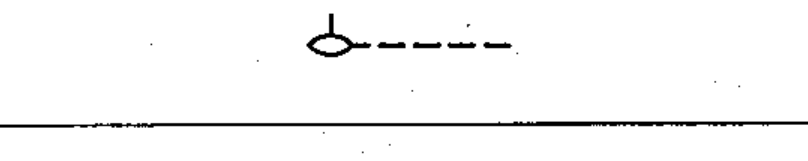

# 02-14-01 — Control by fluid level

Per-symbol crop from Publication No.617-2.pdf, printed p.27 ([full page](../assets/60617-2/p29.png)).

**Standard:** [[60617-2]] · **Chapter III — Other symbols having general application** · **Section:** [[60617-2-14-non-electrical-control]]

## Description
Control by fluid level.

## Names
- **EN:** Control by fluid level
- **FR:** Commande par le niveau d'un fluide

## Notes
- Letter symbols from IEC Publication 27 may be used to denote operating quantities.

## Related
- references **IEC 27**
